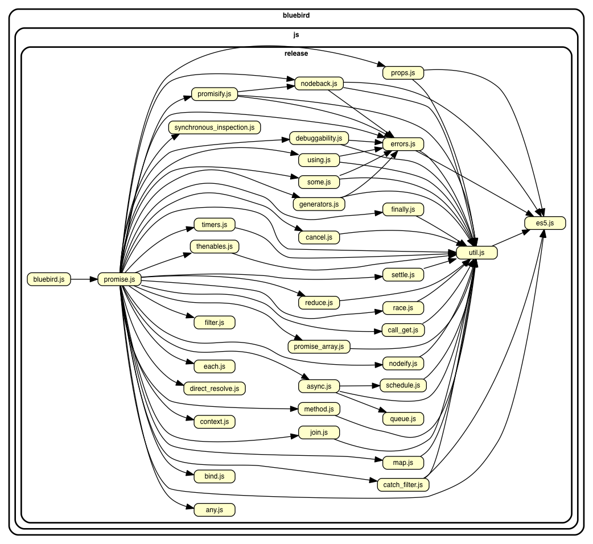
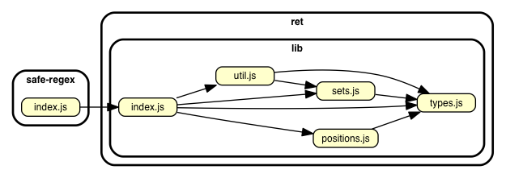
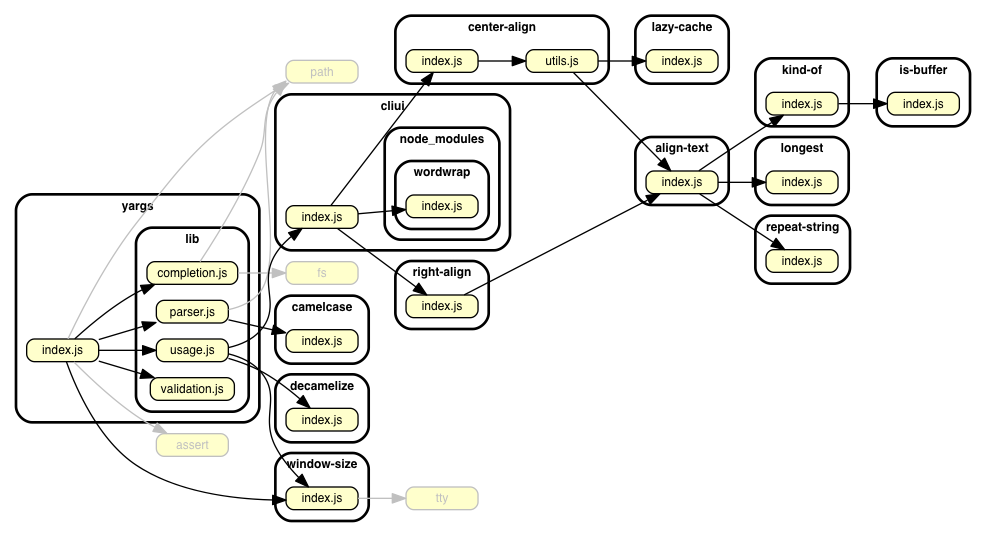
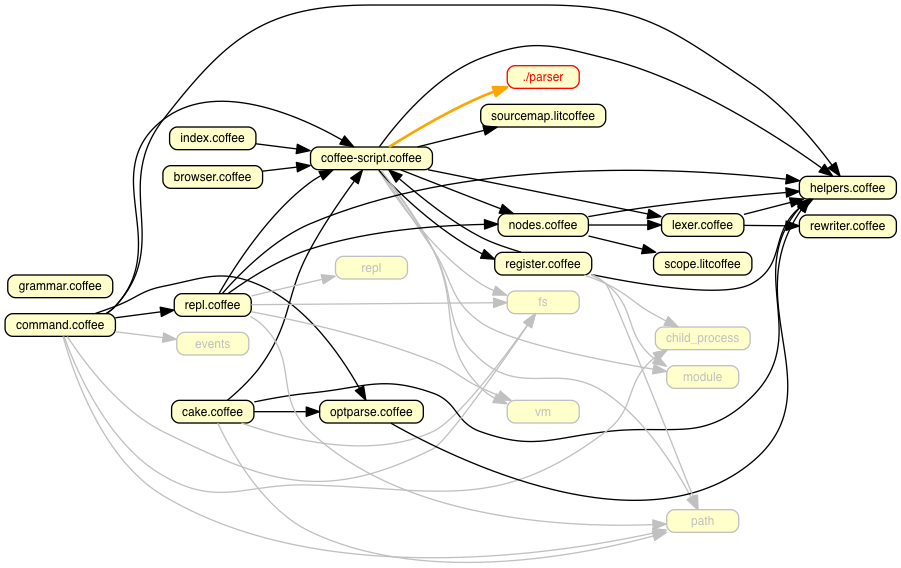

# Real world projects. Dependency cruised.

## Some popular projects on npm

### Commander

[tj/commander.js](https://github.com/tj/commander.js) - For command line parsing - and cooking command line interfaces.


### Chalk

[chalk/chalk](https://github.com/chalk/chalk) -
For coloring strings in the terminal. A typical _Sorhus style_ micro module that uses other micro modules to accomplish its goals.


### Bluebird

[petkaantonov/bluebird](https://github.com/petkaantonov/bluebird) - promise library



### Safe-regex

[substack/safe-regex](https://github.com/substack/safe-regex) - for sanity checking regular expressions against exponential time errors. For everyone who enables users to input regular expressions in.



### Resolve

[substack/node-resolve](https://github.com/substack/node-resolve) - resolves (node) module names to files on disk.


### Yargs

[yargs/yargs](https://github.com/yargs/yargs) - Another library to parse command line options/ cook command line interfaces.



## Typescript

It is possible to use dependency-cruiser to infer dependencies of typescript
projects.

We got the picture of tslint by running this in its source folder:

```sh
dependency-cruise -T dot -x node_modules -v -- src/index.ts  | dot -T png > tslint-without-node_modules.png
```

(Yep, that's all - no separate transpilation steps necessary ...)

### tslint

[palantir/tslint](https://github.com/palantir/tslint) - linter for typescript.

The orange lines are warnings for circular dependencies, which occur around two of
tslint's 'barrel' `index.ts` modules:


## CoffeeScript

In the same vein dependency-cruiser directly supports CoffeeScript.

In the `src` folder of the coffeescript repo run this:

```sh
depcruise -x node_modules -T dot . | dot -T png > coffee-script-coffee-without-node_modules.png
```

### coffeescript

[jashkenas/coffeescript](https://github.com/jashkenas/coffeescript) - the
coffeescript transpiler:



(You see one module flagged as _unresolvable_ - this is the parser code
that the coffeescript build script generates jison into the folder with
transpiled javascript.)

## My own projects

### dependency cruiser

Dependency cruiser used on itself. node_modules left out to keep it concise. A
small [custom theme](rules-reference.md#dot) in its [configuration](../.dependency-cruiser.json#L196)
colors the various main parts (extract, validate, report) and the dependencies to
them. Click for a slightly more interactive version.

[](https://sverweij.github.io/dependency-cruiser/dependency-cruiser-dependency-graph.html)

### state machine cat

[sverweij/state-machine-cat](https://github.com/sverweij/state-machine-cat) - an
interpreter for writing nice state diagrams. Click for a slightly
more interactive version.

[](https://state-machine-cat.js.org/dependency-cruiser-graph.html)

### mscgen.js

[mscgenjs/mscgenjs-core](https://github.com/mscgenjs/mscgenjs-core) - an
interpreter library for turning text (in MscGen or two other DSLs) into sequence
charts. Click for a slightly more interactive version.

[](https://mscgenjs.github.io/mscgenjs-core/dependencygraph.html)
